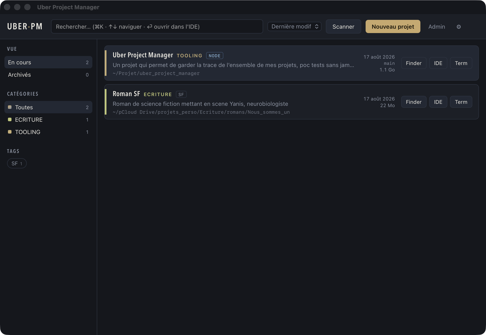

<p align="center">
  
</p>

# Uber Project Manager

Hub local pour garder la main sur tous ses projets, POC et expérimentations :
une app de bureau macOS légère (Tauri + React + SQLite) qui référence chaque
projet, le retrouve en trois lettres et l'ouvre dans l'IDE en une touche.



## Fonctionnalités

### Fiches projet
- Nom, description, catégorie, tags, chemin sur le disque
- Lien repo distant **ou** chemin de sauvegarde, avec bouton d'ouverture
- Statut : Actif, En pause, Terminé, Abandonné — les deux derniers rangent le
  projet dans une vue « Archivés » séparée
- Changelog manuel : notes datées automatiquement, en timeline

### Navigation
- Recherche plein texte (nom, description, tags, chemin) focalisée à
  l'ouverture, rappelable avec `⌘K`
- Mode launcher : `↑`/`↓` pour naviguer, `⏎` pour ouvrir le projet dans l'IDE,
  `Échap` pour vider la recherche
- Filtres par catégorie et tags, tri configurable (dernière modif, création,
  nom), persisté entre les sessions
- Chaque catégorie reçoit une couleur stable qui marque la « tranche » de la
  carte projet

### Actions rapides
- Ouvrir dans le **Finder**, dans l'**IDE** (commande configurable : `code`,
  `cursor`, `zed`, `open -a …`) ou dans le **terminal** (app configurable :
  Terminal, iTerm, Ghostty…)

### Référentiels administrés
- Catégories et tags gérés dans une modale d'administration : créer, renommer
  (propagé à tous les projets), supprimer (avec repli « Sans catégorie » /
  retrait du tag partout)
- Pas de saisie libre dans le formulaire projet : on coche des tags existants,
  on choisit une catégorie dans la liste

### Vérité du disque
- Vérification du chemin à la création et au lancement : bannière listant les
  projets dont le dossier a disparu, badge « introuvable », bouton
  **Retrouver…** pour re-pointer le dossier déplacé en un geste
- Analyse en tâche de fond de chaque projet :
  - **Git** : branche courante, date du dernier commit, indicateur de modifs
    non commitées
  - **Badges techno** automatiques (rust, node, python, go, java, ruby, php,
    swift, docker) d'après les fichiers marqueurs
  - **Taille disque**, avec détail des dossiers récupérables (`node_modules`,
    `target`, `dist`, `.venv`, …)

### Import & sauvegarde
- Scan multi-racines : pointe un ou plusieurs dossiers (mémorisés), l'app
  liste les sous-dossiers non référencés (avec détection `.git`) et les
  importe à la coche
- Export JSON complet de la base (projets, changelogs, catégories, tags,
  réglages) et accès direct au fichier SQLite dans le Finder

## Stack

- [Tauri 2](https://tauri.app) — coquille native, commandes Rust
- React 19 + TypeScript + Vite
- SQLite via `rusqlite` (base dans
  `~/Library/Application Support/com.remy.uberprojectmanager/`)

## Développement

Prérequis : Rust, Node ≥ 20, pnpm, Xcode Command Line Tools.

```bash
pnpm install
pnpm tauri dev     # app en mode dev, hot-reload front et back
```

## Build

```bash
pnpm tauri build   # produit .app et .dmg dans src-tauri/target/release/bundle/
```

L'app n'est pas signée : au premier lancement, clic droit → Ouvrir.

## Raccourcis

| Touche | Action |
| --- | --- |
| `⌘K` | Focus sur la recherche |
| `↑` / `↓` | Naviguer dans la liste |
| `⏎` | Ouvrir le projet ciblé dans l'IDE |
| `Échap` | Vider la recherche, puis fermer le panneau de détail |
